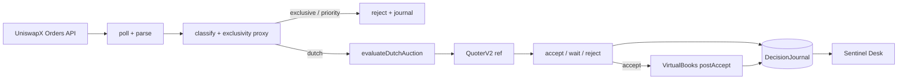

<div align="center">

# CavalRe Sentinel — Base

**Capital-safety-first UniswapX research filler on Base**

Selective Dutch · Amount-safe math · Fail-closed risk · Journal-first desk · Live capital off until go/no-go

[](https://github.com/RedRobotKK/CavalRe-Sentinel-Base/actions/workflows/ci.yml)
[](https://nodejs.org/)
[](LICENSE)
[](https://base.org)
[](docs/GO_NO_GO.md)
[](docs/PHASE_A.md)
[](docs/PHASE_B.md)

[Quick start](#quick-start) · [Phases](#integration-phases-a--e) · [Math](#core-math) · [Architecture](#architecture) · [Desk](#sentinel-desk) · [Screenshots](#screenshots) · [Docs](#documentation)

</div>

---

## Why this exists

Most UniswapX filler demos optimize for **speed and volume**.  
This stack optimizes for **survival of small capital**:

- Every money value is an **Amount** (`bigint`) — [FloatLib](https://github.com/CavalRe/cavalre-contracts/blob/main/math/FloatLib.sol) discipline off-chain  
- **Edge is computed** against Uniswap v3 QuoterV2 — never assumed  
- **Dutch decay is resolved before** risk and policy  
- **Post-exclusive** Dutch can trade after `decayStartTime` (exclusivity proxy)  
- **Virtual books** mirror Ledger sleeves before any on-chain capital  
- The **journal is the book**; the desk only visualizes what was written  
- **Live mode is hard-disabled** until [`docs/GO_NO_GO.md`](docs/GO_NO_GO.md) clears  

> **Capital safety > daily PnL.**  
> **Journal quality > volume.**  
> **Accept rate ≠ win rate.**  
> **NEVER TRUST, ALWAYS VERIFY.**

---

## Integration phases (A → E)

Built on [cavalre-contracts](https://github.com/CavalRe/cavalre-contracts) as **source of truth** for Float + Ledger.

```text
A Policy spec ──► B Virtual books ──► C FloatLib port
                         │
                         ▼
                  D Live capital ──► E Product
```

| Phase | Name | Status | Live capital | What ships |
|-------|------|--------|--------------|------------|
| **A** | Policy spec | **Done** | No | FloatLib constants, Ledger→policy map — [PHASE_A.md](docs/PHASE_A.md) |
| **B** | Virtual books | **Done** | No | `VirtualBooks` sleeves + postAccept — [PHASE_B.md](docs/PHASE_B.md) |
| **C** | FloatLib port | Next | No | TS Float ops verified against forge tests |
| **D** | Live capital | Gated | **Yes*** | Dispatcher + Ledger on Base |
| **E** | Product | Planned | Yes* | Claim/internal PnL sleeves |

\*Only after [GO_NO_GO.md](docs/GO_NO_GO.md).

---

## Quick start

```bash
git clone git@github.com:RedRobotKK/CavalRe-Sentinel-Base.git
cd CavalRe-Sentinel-Base
npm install
npm test && npm run typecheck && npm run audit:high
```

### Mainnet dry-run (no keys, no broadcast)

```bash
export BASE_RPC_URL=https://mainnet.base.org
npm run dry-run
```

### Sentinel Desk

```bash
npm run desk:api    # :8787
npm run desk:web    # :5173
```

### Research helpers

```bash
npm run flow-report
npm run shadow-markout
npm run float-compare   # IEEE vs bigint research only — not FloatLib
```

---

## Screenshots

| Asset | Capture |
|-------|---------|
| `docs/assets/desk-circuit.png` | Hero circuit at http://127.0.0.1:5173 |
| `docs/assets/desk-drops.png` | Drop-reasons ranked list |
| `docs/assets/desk-intent-log.png` | Human-readable intent log |
| `docs/assets/dry-run-terminal.png` | `npm run dry-run` heartbeats |

```bash
mkdir -p docs/assets
```

---

## Core math

All value-bearing quantities are **non-negative integers** (`Amount` = `bigint`).

### Linear Dutch decay

$$
A(t) =
\begin{cases}
A_s & t \le t_s \\
A_e & t \ge t_e \\
A_s + \dfrac{(A_e - A_s)\,(t - t_s)}{t_e - t_s} & t_s < t < t_e
\end{cases}
$$

### Edge (computed, never assumed)

$$
e_{\mathrm{bps}} = \left\lfloor \frac{(O_{\mathrm{ref}} - O_{\mathrm{res}}) \cdot 10^{4}}{O_{\mathrm{ref}}} \right\rfloor
$$

---

## Architecture



### Compliant cycle

```text
classify(now) → quote ref → evaluateDutchAuction → journal
                                         ↘ VirtualBooks (Phase B)
```

---

## RULE OF TRUST

| Source | Role |
|--------|------|
| [CavalRe/cavalre-contracts](https://github.com/CavalRe/cavalre-contracts) | FloatLib, Ledger |
| [Uniswap/UniswapX](https://github.com/Uniswap/UniswapX) | Reactors, decay |
| This repository | Implementation under test |

**NEVER TRUST, ALWAYS VERIFY.**

---

## Documentation

| Doc | Contents |
|-----|----------|
| [PHASE_A.md](docs/PHASE_A.md) | Policy spec |
| [**PHASE_B.md**](docs/PHASE_B.md) | **Virtual books** |
| [TRUST_CAVALRE_CONTRACTS.md](docs/TRUST_CAVALRE_CONTRACTS.md) | Float / Ledger primitives |
| [GO_NO_GO.md](docs/GO_NO_GO.md) | Live capital gates |
| [docs/README.md](docs/README.md) | Full index |

---

<div align="center">

**NEVER TRUST, ALWAYS VERIFY.**

MIT © RedRobotKK

</div>
